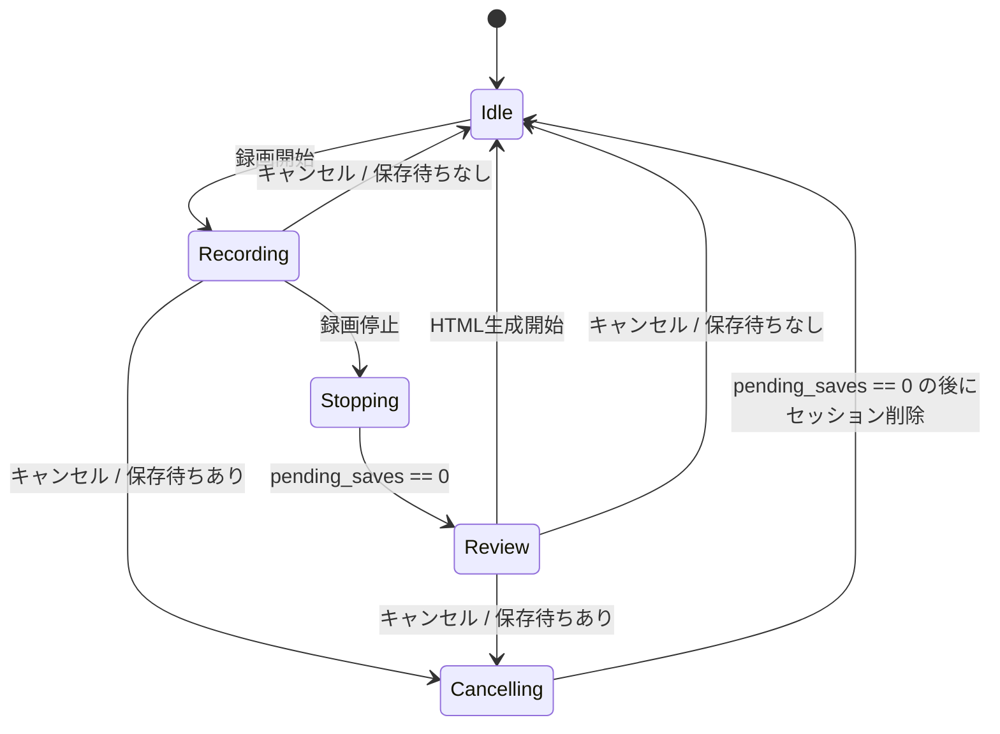

# State Machine

SleekManualMaker uses an explicit application state machine so that recording,
background saves, cancellation, and review do not race each other.

## States

- `Idle`: 録画していない待機状態。前回セッションの結果ログを表示できる。
- `Recording`: 入力イベントを監視し、記録対象イベントを保存キューへ送る。
- `Stopping`: 録画フラグを止め、バックグラウンド保存がすべて終わるのを待つ。
- `Review`: `session_log.jsonl` を読み込み、セッション概要とHTML生成ボタンを表示する。
- `Cancelling`: 保存中のデータが残っている場合、保存処理完了を待ってからセッションフォルダを削除する。

## Save Synchronization

`pending_saves` tracks in-flight recording work:

- Event processing increments it before preparing a save.
- If the event is not recorded or queueing fails, the guard decrements it automatically.
- Once a save is queued successfully, the background save thread owns the decrement.
- `Stopping` and `Cancelling` only proceed when `pending_saves == 0`.

This avoids reading `session_log.jsonl` before the last screenshot/log entry has been written, and avoids deleting a session folder while a background save is still writing into it.
